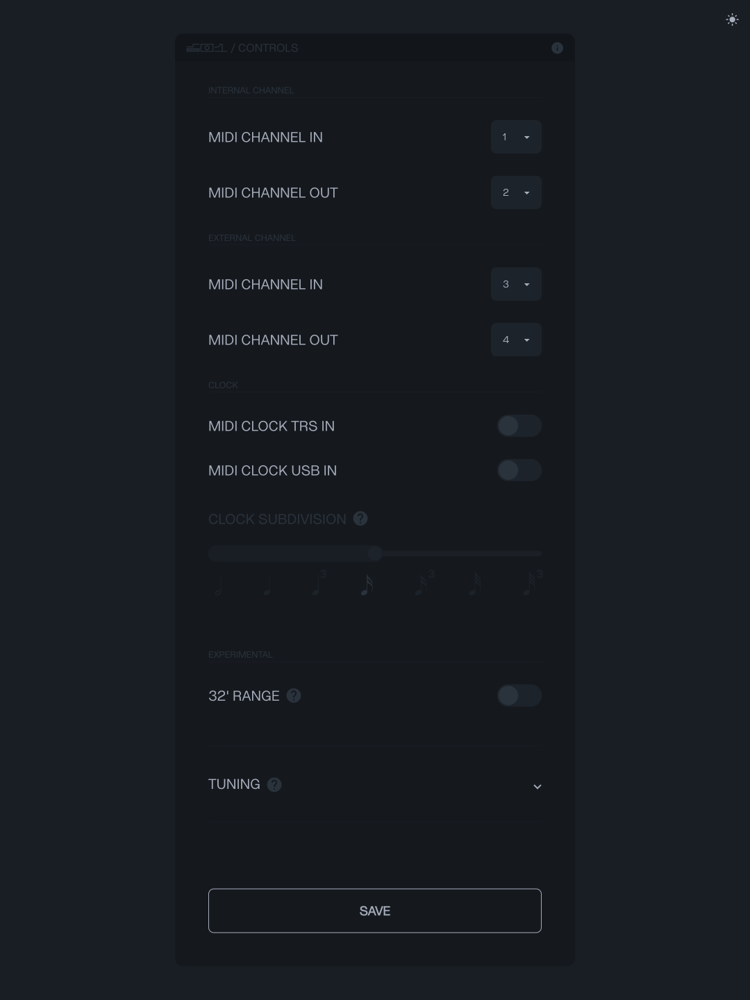

## Configure

The SB01 can be configured through a [WebUSB enabled browser](#browser-chart).

Connect the SB01 to your computer using a USB-C cable and click the on-screen notification.  
If you don't see a notification, try directing your browser to [control.playsuperlative.com](https://control.playsuperlative.com/).

When SB01 is connected, the app will look like [FIGURE 2.1](#figure-2.1).

{#figure-2.1}

### Enabling MIDI for internal/external machines

Use the switch matrix at the top of the controls app to enable or disable TRS and USB MIDI for the internal and external machines.

### Setting MIDI channels

Use the `MIDI CHANNEL IN` and `MIDI CHANNEL OUT` selectors to set which channels the SB01 will listen to and transmit on.

### Enabling MIDI clock (MIDI sync)

Use the `MIDI CLOCK TRS IN` switch to enable or disable MIDI sync on the TRS MIDI input.  
Use the `MIDI CLOCK USB IN` switch to enable or disable MIDI sync on the USB MIDI input.  
When enabled, the SB01 will listen to incoming MIDI clock messages.

The `CLOCK SUBDIVISION` slider divides the incoming MIDI clock and sets the speed of the arpeggiator and sequencer.

---
