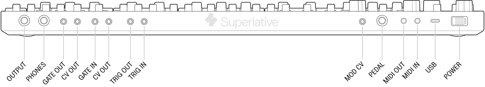

## Rear panel connections

<article>

`USB`: Used to charge the SB01. Connect to a computer for USB MIDI, device configuration, and firmware updates.

`MIDI IN`: TRS Type-A 3.5mm MIDI input.

`MIDI OUT`: TRS Type-A 3.5mm MIDI output.

`PEDAL`: Hold/Sustain pedal input.

`MOD CV`: Mod CV input for VCO/VCF (0 ~ 5v)

`TRIG IN`: Trigger input, +2.5V or higher.

`TRIG OUT`: Trigger output. 5V signal.

`CV IN`: 1V / 1Oct Control voltage input, 0-7V

`GATE IN`: Gate input, +2.5V or higher.

`CV OUT`: CV output from the `EXTERNAL` engine.

`GATE OUT`: Gate signal from the `EXTERNAL` engine.

`PHONES`: Stereo headphone output.

`OUTPUT`: Line level audio ouput.

</article>

---
