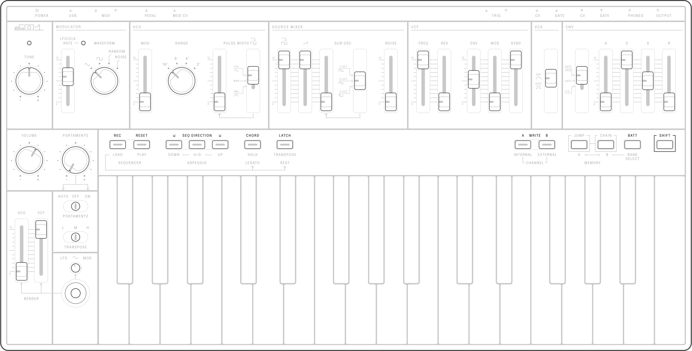

## Controls

<article>

- `TUNE`
- `MODULATOR`
  - `LFO/CLK RATE`
  - `WAVEFORM`
- `VCO`
  - `MOD`
  - `RANGE`
  - `PULSE WIDTH` Slider
  - `PULSE WIDTH` Switch
- `SOURCE MIXER`
  - `PULSE` Level Slider
  - `SAW` Level Slider
  - `SUB OSC` Level Slider
  - `SUB OSC` Selector Switch
- `VCF`
  - `FREQ`
  - `RES`
  - `ENV`
  - `MOD`
  - `KYBD`
- `VCA` Envelope Switch
- `ENV`
  - Trigger Mode
  - `A`
  - `D`
  - `S`
  - `R`
- `VOLUME`
- `PORTAMENTO`
- `PORTAMENTO` Mode Toggle
- `TRANSPOSE` Toggle
- `BENDER`
  - `BENDER VCF`
  - `BENDER VCO`
  - `LFO MOD`

</article>

---
