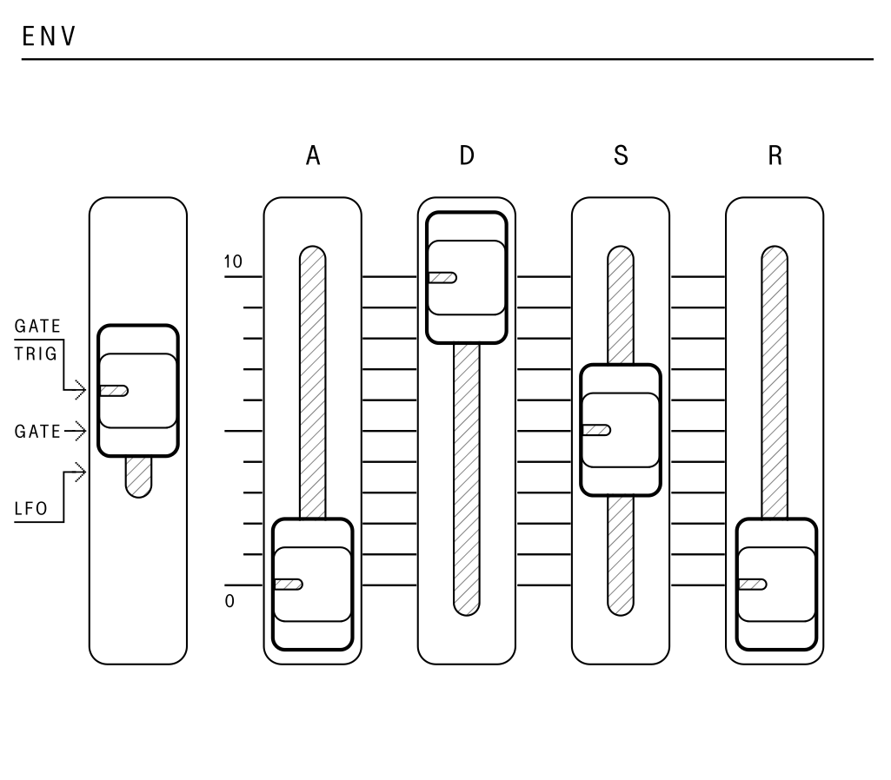

## Envelope Generator (ENV)

<article>

::: {.16/12}

:::

The envelope generator is a standard four-stage envelope. It can be used to modulate pulse width, filter cutoff, and most commonly- the amplitude of sound over time.

An envelope works in two stages. First, when the envelope is triggered (by a keypress or gate), it will increase its voltage to the maximum amount in a period of time controlled by the "attack" parameter. Once the maximum voltage has been reached, the envelope will decrease to another voltage level determined by the "sustain" parameter. The time it takes to get to the sustain level after the attack phase is controlled by the "decay" parameter. The envelope will stay at the sustain level until the note is let go.

Once the note is released, the envelope will return to zero voltage. The amount of time this takes is controlled by the "release" parameter. In summary – attack, decay, and release all control the time constants, while sustain controls the level.

The envelope is the primary way of shaping of a sound, especially when routed to the filter cutoff. For example, a typical "pluck" sound has no attack, a short delay, no sustain, and no release, while a "pad" sound may have a long attack and decay, a middle sustain, and a long release.

On the SB01, the envelope controls are:

- `A` – Attack time of the envelope
- `D` – Decay time of the envelope
- `S` – Sustain level of the envelope
- `R` – Release time of the envelope

Additionally, the three settings of the `ENV` mode switch controls how the envelope is triggered.

1. In `GATE` mode, the envelope is started by a keypress event and will transition to the release phase when the last key is let go. If additional notes are played, the envelope will not reset to the beginning.

2. In `GATE+TRIG` mode, the envelope will be started by a keypress event and will transition to the release phase when any key is let go. If additional notes are played, the envelope will reset at the beginning of each new note.

3. In `LFO` mode, the envelope will be triggered by each cycle of the `LFO` when a note on the keyboard is played and held. The `LFO/CLK RATE` will also now reset on the first key press.

</article>

---
