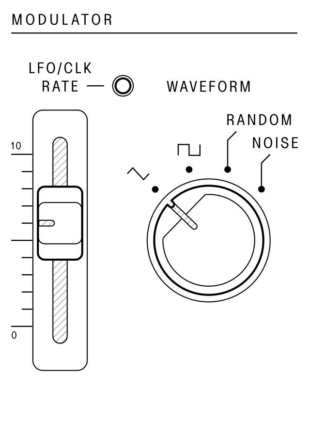

## Modulator (LFO/CLK)

<article>

::: {.16/12}

:::
::: {.prevent-break}
The `MODULATOR` section houses a low-frequency oscillator (`LFO`) and `RANDOM` waveform (Sample & Hold) that can be used to modulate several parameters across the synth including pitch, pulse width, and filter cutoff.
:::
The `LFO/CLK RATE` slider controls the frequency of the LFO. The rate of cycling controls the speed of the arpeggiator and sequencer unless they are driven by an external clock source using the `TRIG` input.

The `WAVEFORM` switch selects the ouput shape of the LFO. Triangle and square are the output waveforms from the `LFO`, while the `RANDOM` output waveform is generated digitally. Each cycle of the LFO will produce a new random modulation level that is held until the next clock cycle. The `NOISE` waveform is the internal white noise source and is not affected by the LFO rate control.

</article>

---
