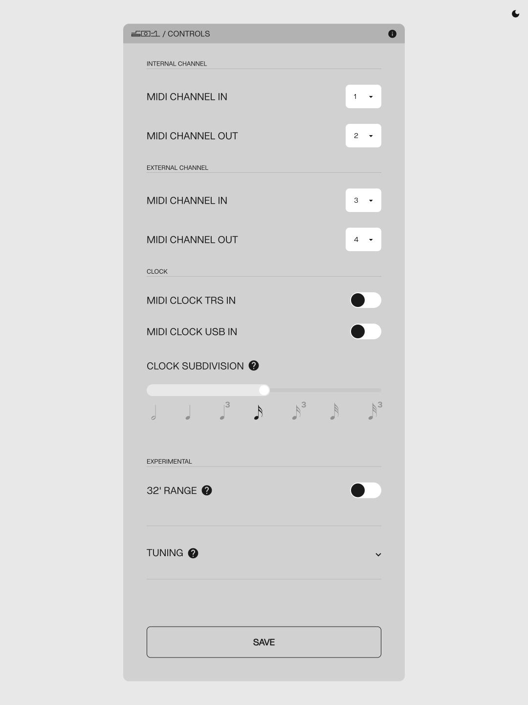

# Microtuning Tool

<article>

Custom tuning tables for the SB01 can be configured through a [WebUSB enabled browser](#browser-chart).

The custom tuning table can be edited in the control app.

When the device is connected, the app will look like [FIGURE 2.1](#figure-2.1).

{#figure-2.1}

A unique tuning offset can be entered for each key on the SB01. After entry, the offset will be applied to the connected SB01 immediately.

#### Setting Active Table

If the first key on the keyboard is held at startup the custom tuning table will be loaded. If no key is held at startup the default tuning table will be loaded.

#### Load Custom Tuning Tables

 Loading of .tun tuning table files directly in the control app is supported. Press the LOAD button and navigate to your . The table will be applied to the connected SB01 immediately.

#### Resetting Defaults

 User configuration can now be reset to factory defaults by holding both `MEMORY` buttons (`JUMP` + `CHAIN`) while powering on the device.

**Tip:** Use the sun/moon icon at the top right of the app to switch between [light]{.light-switch} and [dark]{.dark-switch} mode.

</article>

---
