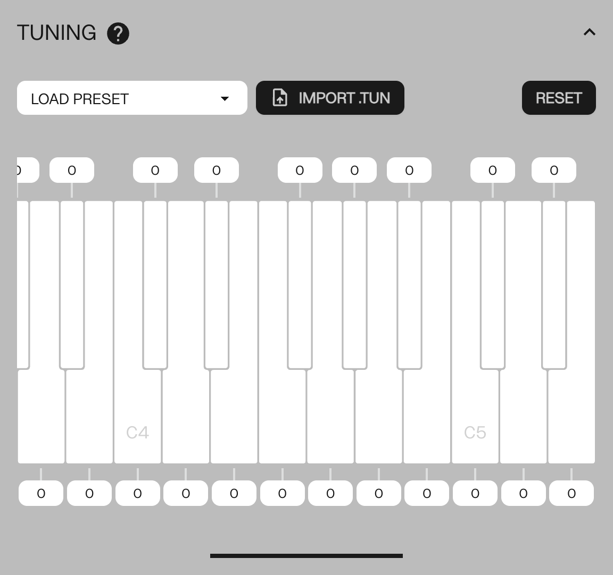

# Microtuning Tool

<article>

Custom tuning tables for the SB01 can be configured through a [WebUSB enabled browser](#browser-chart).

Tuning tables are edited in the `CONFIGURATION TOOL` app. [FIGURE 2.2](#figure-2.2).

{#figure-2.2}

An adjustable tuning offset can be applied to each key on the SB01 in cents (-99 to +99). Click and drag on a key to adjust its offset, or enter a value directly in the input box. After entry, the offset will be directly applied to the connected synth.

Upon saving, the tuning table will be stored in the user tuning table slot.

#### Setting Active Table

If the first key on the keyboard is held at startup the custom tuning table will be loaded. If no key is held at startup, the default tuning table will be loaded.

#### Load Custom Tuning Tables

 Importing a .tun file allows you to load an existing tuning table directly and go beyond +-99 cents. Press the `IMPORT .TUN` button and navigate to a .tun file, and the table will be applied.

#### Preset Tuning Tables

 For microtonal exploration, several presets options are available.

</article>

---
