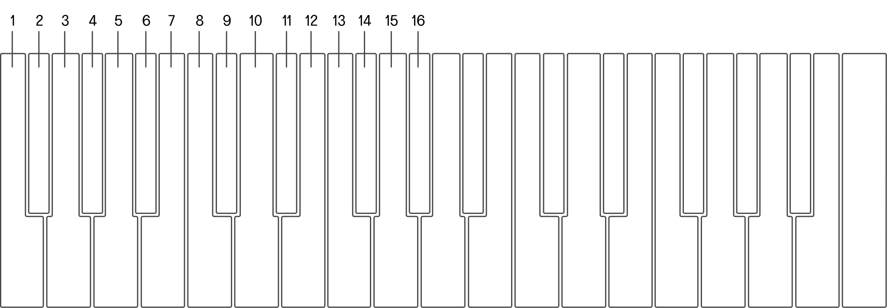

# On-Device Configuration

<article>

Although the preferred way of configuring SB01 is through the [Control App](https://control.playsuperlative.com/), there is a way of configuring without connecting a computer.  
While holding `SHIFT`, the on-device configuration menu is presented on the SB01 keyboard

After pressing and holding `SHIFT` you are at the top-level menu described in [FIGURE 3.1](#figure-3.1). Press the key that corresponds to the parameter you want to adjust, and while still holding `SHIFT` press the key representing the value you wish to set.

The values for each parameter are described in [FIGURE 3.2-3.6](#figure-3.2).

If you wish to save the changes, press and hold `SHIFT` and then press the last key (the key directly under `SHIFT`) on the keyboard.

</article>

### Top Level Menu
{#figure-3.1}

### INTERNAL MIDI CHANNEL IN INTERNAL MIDI CHANNEL OUT EXTERNAL MIDI CHANNEL IN EXTERNAL MIDI CHANNEL OUT
{#figure-3.2}

### MIDI CLOCK
{#figure-3.3}

### MIDI CLOCK SUBDIVISION
{#figure-3.4}

### MIDI NOTE OFFSET
{#figure-3.5}

### MIDI SOFT-THRU
{#figure-3.6}

---

