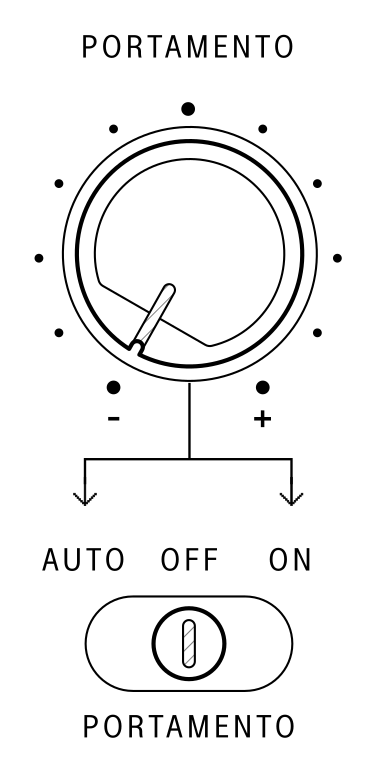

## Portamento

<article>

::: {.16/12}

:::

Portamento is the musical term for continuous pitch glide or slew between notes.

To enable portamento, toggle the `PORTAMENTO` switch to either `ON` or `AUTO`. The glide speed can be controlled using the `PORTAMENTO` knob.

In the `ON` position, the SB01 will glide in pitch between every note change. 

In `AUTO` mode, the glide effect activates only when playing a new key while the previous key is still held down (*legato* playing). This "hold-and-glide" allows for selective control over how portamento is applied.

**Example:**

1. Hold the C key. Then, play the G key.
2. The oscillator will glide from C to G.
3. If you release the C key before playing G, no glide will occur.

In the `OFF` position, the glide effect will not be applied.

**Tip:** The SB01 has independent `PORTAMENTO` settings for each channel of `INTERNAL` or `EXTERNAL` control. Portamento speed will be the same between both channels, while changing the toggle in each channel refreshes the `PORTAMENTO` state.

</article>

---
