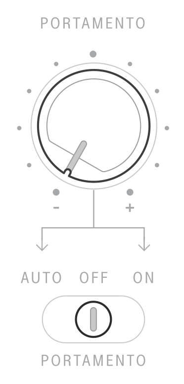

## Portamento

<article>

::: {.16/12}

:::

Portamento is the musical term for continuous pitch glide or slew between notes.

To enable portamento, toggle the `PORTAMENTO` switch to either `ON` or `AUTO`. The time of the glide can be controlled using the `PORTAMENTO` knob.

In the `ON` position, the SB01 will glide the pitch between every note. 

In `AUTO` mode, the SB01's glide effect activates only when you play a key *while still holding a previous key*. This "hold-and-glide" allows for expressive control.

**Example:**

* Hold the C key. Then, play the G key.
* The oscillator will glide from C to G.
* If you release the C key before playing G, no glide will occur.

In the `OFF` position, the glide effect will not be applied to any played notes.

The SB01 has independent portamento states for each channel, so you can operate either channel with any `PORTAMENTO` setting. However, the portamento speed will be the same between both channels. Moving the toggle in each mode refreshes the `PORTAMENTO` state in each channel.

</article>

---
