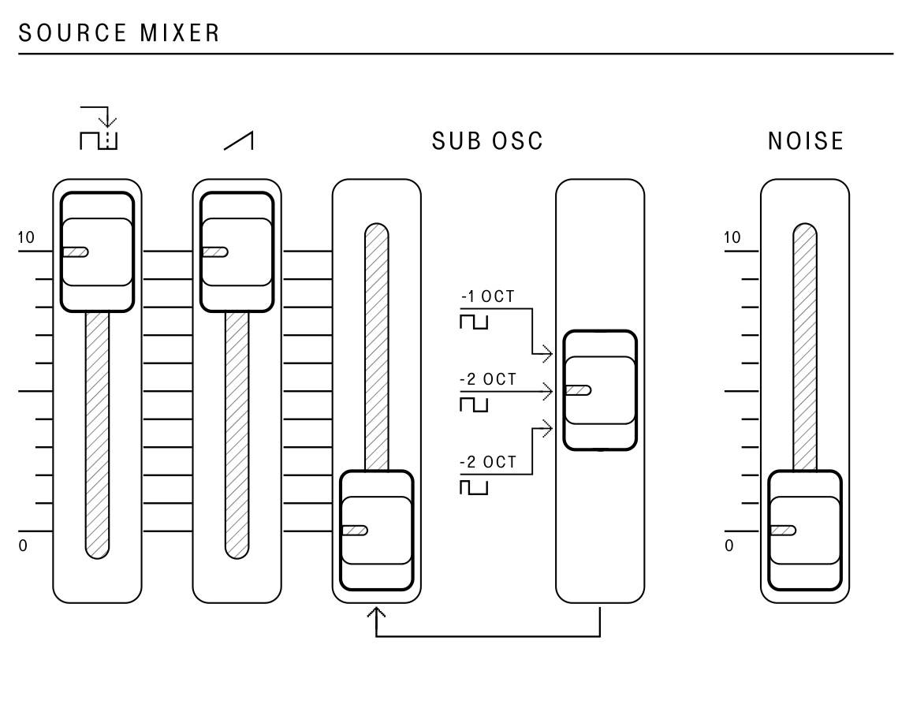

## Source Mixer

<article>

::: {.16/12}

:::

The `SOURCE MIXER` section contains controls to sum together the tone sources created by the `VCO` into various timbre combinations, with the addition of white noise and sub-oscillator waveforms.

The `PULSE` slider controls the amount of pulse waveform that is mixed in. The pulse width is configured using the controls in the `VCO` section.

The `SAW` slider controls the amount of sawtooth wave that is mixed in.

The `SUB OSC` slider controls the amount of sub-oscillator that is mixed in. The sub-oscillator is divided down from the oscillator and will thus be exactly one or two octaves lower than the `VCO` pitch. Using the `SUB OSC` switch, the output can be set to:

- A square wave one octave below
- A square wave two octaves below
- A 25% duty cycle pulse wave two octaves below

The `NOISE` slider controls the amount of white noise that is mixed in.

</article>

---
