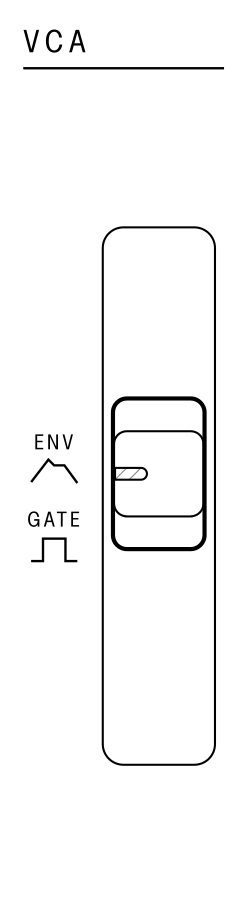

## Voltage Controlled Amplifier (VCA)

<article>

::: {.16/12}

:::

The voltage controlled amplifier (`VCA`) section controls the amplitude, or volume of a note over time as it is played.

When the `VCA` is set to `GATE` mode, the volume of the note will be at the maximum as soon as a note is played, and will stop as soon as the note is released.

When the `VCA` is set to `ENV` mode, the volume of the note will follow the shape of the envelope generated by the settings in the `ENV` section.

</article>

---
