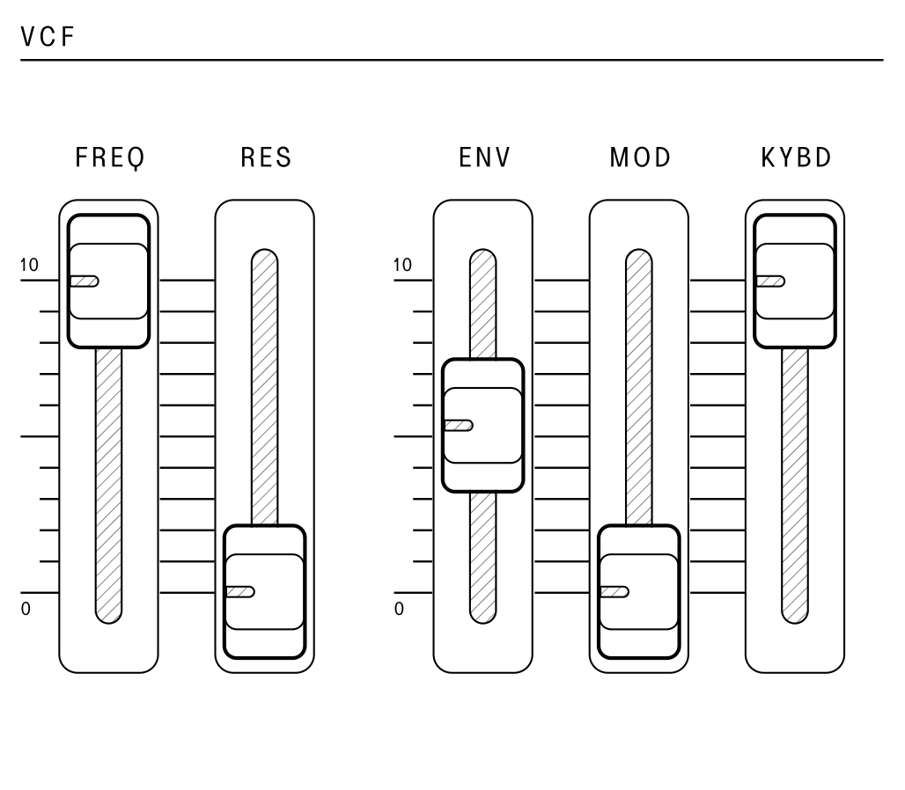

## Voltage Controlled Filter (VCF)

<article>

::: {.16/12}

:::

The voltage controlled filter (`VCF`) is used to shape the tone color of the combined sound coming from the `SOURCE MIXER` section by cutting or boosting harmonics in the sound. The `VCF` in the SB01 is a four-pole low-pass filter based on the IR3109.

The `FREQ` slider controls the cutoff point of the low-pass filter to define the brightness of the sound, with the lower position cutting frequencies and the highest position letting all frequences pass.

The `RES` slider controls the amount of filter feedback (sometimes called resonance) that is applied at the cutoff point of the filter. This can emphasize certain harmonics and boost frequencies when shaping a sound or moving the cutoff.

The `ENV` slider controls the amount of depth that the output of the envelope generator modulates the filter cutoff position. The cutoff frequency will change with each note in the pattern of the ADSR pattern previously set, giving articulation to each note's brightness.

The `MOD` slider controls the amount of depth that the `LFO` modulates the filter cutoff position. The filter cutoff will change depending on the waveform selected in the `MODULATOR` section.

The `KYBD` slider controls the amount of keyboard `CV` that is applied to the filter cutoff based on the note played. This can be useful for creating sounds that become brighter as higher notes are played.

#### Self-Oscillation

With the resonance control set to maximum, the resonant peak of filter will feed back into itself to the point of self-oscillation. This type of oscillation results in a pure sine wave with no harmonics.

To explore the filter in self-oscillation, set `FREQ` to about half, and set `RES` and `KYBD` to the maximum. The filter output will track the keyboard note played to within 1%. Use the `FREQ` slider to adjust the offset or turn down the other tone sources in the `SOURCE MIXER` to taste.

</article>

---
